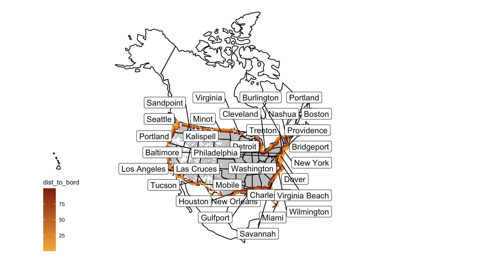
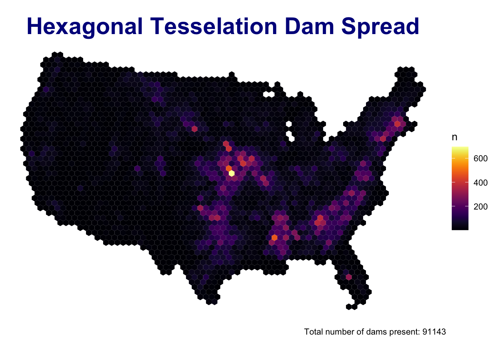
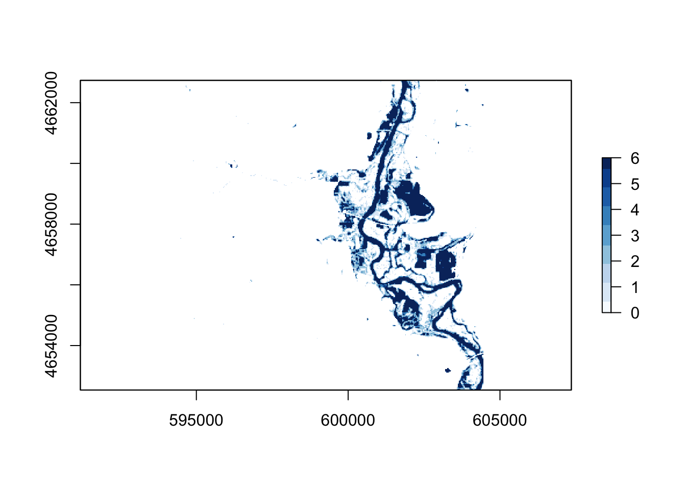
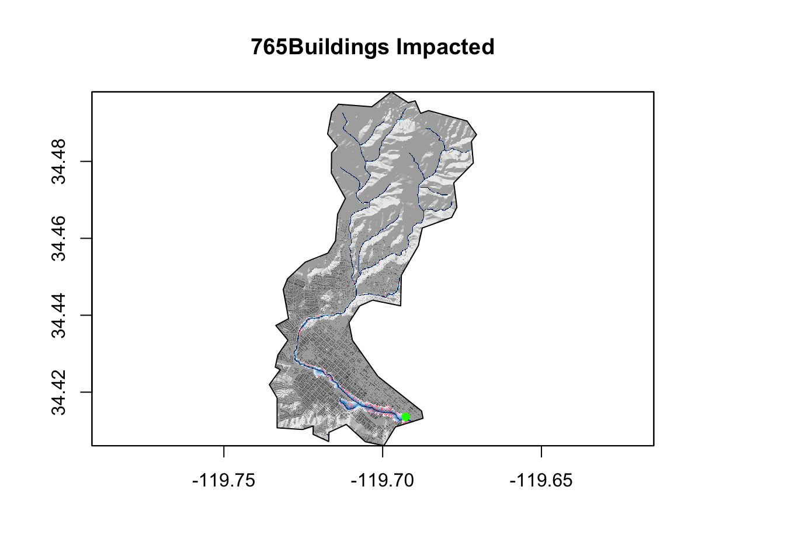

---

My last term at UCSB was summer session B of 2020. During this time, I took a Geography class emphasizing on GIS based in the language R. We learned the basics of coding, observed and manipulated data, and created our own websites to showcase what we learned and the projects we produced. 

---

# [Lab #2](https://j-molinski.github.io/grog-176-lab2/Lab02.html)
## Data Wrangling

- This lab project involved learning to work with and manipulate data frames. 
- We learned to dissect large datasets in order to produce more meaningful statistics and visuals representing the data. 
- The lab focused on COVID-19 data, and visualizing different trends in coronavirus cases in the United States. 
- This lab served as an educative introduction to many of the tools which we continued using in the remainder of our lab and daily exercise activities. 

---

# [Lab #3](https://j-molinski.github.io/grog-176-lab2/Lab03.html)
## Projections, Distance, Mapping

- This lab project involved learning to work with simple feature objects, classes and groups.
- This explorations of sf objects and classes included downloading numerous datasets and converting them to simple feature objects with coordinate reference systems applied. 
- The rest of the lab involved calculating distances between features of the different data sets, and displaying them in both tables and graphically. 
- The real-world application component of this lab involved observing the coastlines of the united states, and evaluating the number of cities and people living within 100 miles from the country border. This evaluation allowed us to visualize the proportion of Americans living within this zone which limits fourth amendment rights due to its proximity to the border. The map produced with these calculations is displayed below:

---

# [Lab #4](https://j-molinski.github.io/grog-176-lab2/Lab04.html)
## Tesselations, Spatial Joins, Point-in-Polygon

- In this lab activity, we learned about the creation and use of tessellations, geometric simplification in order to observe patterns of distribution in data. 
- The data we focused on in this lab was the National Dams Inventory.
- We created and observed the implementation of a number of tessellations across US counties. 
- We then used these tessellations to group data showing the distribution of Dams across the United States.
- Furthermore, we observed the distribution of dams used for different purposes in order to identify any trends and the likely geographic or climatic explanations for their uses. 
- Finally, the extra credit portion of this lab involved identifying dams located on the Mississippi River system which posed high or potentially high threat due to their age or improper maintenance.
- The image below shows the overall distribution of dams across the US using an equal-area Hexagonal Tessellation. 

---

# [Lab #5](https://j-molinski.github.io/grog-176-lab2/Lab05.html)
## Raster Analysis and Remote Sensing

- The skills learned and established in this lab activity included working with and manipulating raster objects, isolating and importing data from the internet into our workplace, and analyzing flood data in the state of Iowa. 
- We obtained data from the landsat8 data source, which allows for specific land and water analysis. 
- We then learned the bands (and associated wavelengths) used to detect and differentiate different land surfaces. We combined the use of these observatory bands with raster algebra to output various indexes which serve as thresholds for identifying water features when using satellite imagery. 
- We used these raster calculations in combination with threshold values to produce 5 plots (based on the various water indexes) showing water-covered regions over an area of Palo, Iowa. 
- Finally, a Kmeans clustering algorithm was applied to produce a kmeans raster. We applied the kmeans flood raster to each of the other water rasters produced in order to identify areas at highest risk of flooding in the region. 
- The plot below visualizes a summed stack of the 6 rasters developed during the lab. This was the finalized flood map for Palo, Iowa. 

---

# [Lab #6](https://j-molinski.github.io/grog-176-lab2/Lab06.html)
## Practical Final: Flood Risk in Mission Creek

- This lab employed the use of various skills learned throughout the quarter in order to analyze and assess flood risks in the Mission Creek Basin of Santa Barbara.
- For this lab, we used data from USGS and NLDI. 
- We evaluated terrain in the area using hillshade analysis and Height Above Nearest drainage. 
- We also evaluated and plotted flood impact in the area for the year 2017. 

