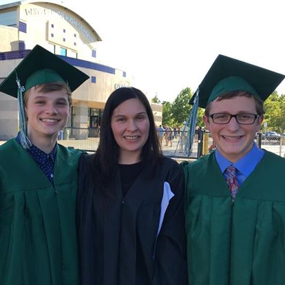
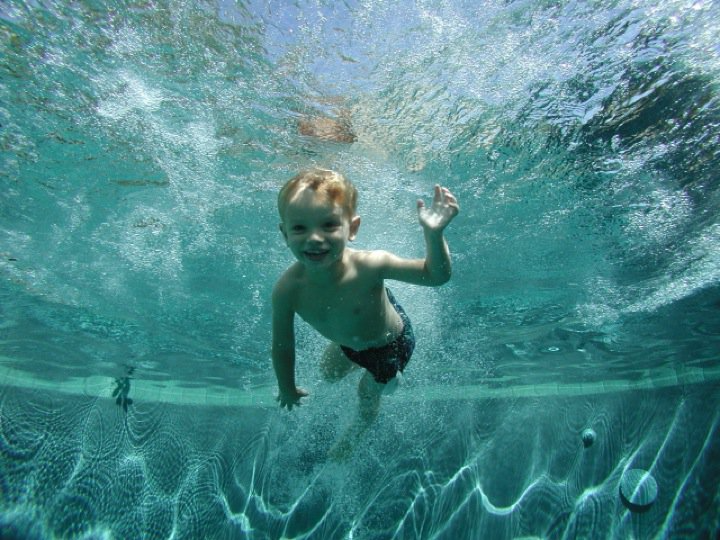
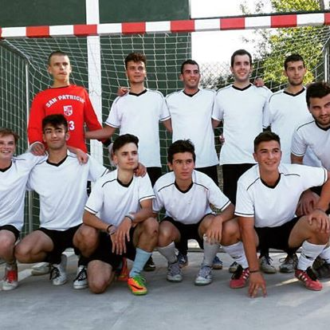
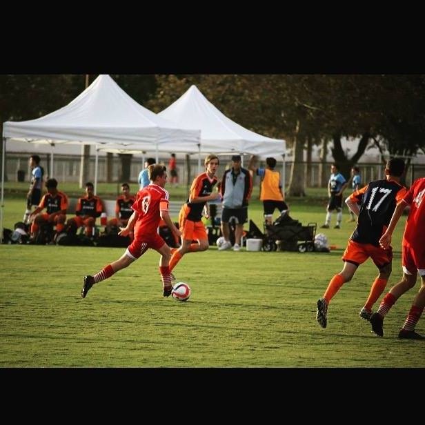

# Hi, I'm Jordan Molinski.

### About Me

**My name is Jordan Molinski, and I am a fourth-year Environmental Science major here at UCSB. I was born and raised in Davis, California but also spent a portion of my childhood in San Diego. When not a student, I work part-time for a sustainable seafood company both as an educator/outreach coordinator and as a sales representative.  While my time at UCSB will shortly come to a close, I hope to further my education by getting a master's degree relating either to renewable energy, or toxicology.  Some of my passions and favorite pastimes include playing and watching soccer, taking my dog on hikes, or going backpacking in California's pristine wilderness.**

### My Github and Contact
- [J-Molinski](https://github.com/J-Molinski)
- Jmolinski@ucsb.edu

### More Photos

---

---

---

---

